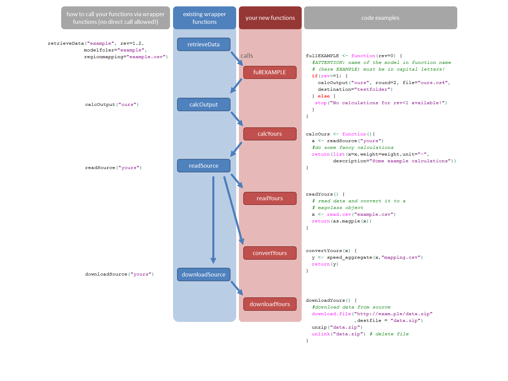

# Data preparation with madrat

madrat is a framework that can help structuring data preparation in R.
It splits the data preparation into separate steps with each having
distinctive requirements about the returned data. The following tutorial
will describe the first steps with the package together with the
specific requirements for each calculation step.

## Setup

madrat requires a local directory to store data such as downloaded
source data, cache files, and output. Running `getConfig` in the package
for the first time you will be asked for a folder to use and store that
setting permanently (if allowed by the user).

``` r
library(madrat)
cfg <- getConfig()
#> Initialize madrat config with default settings..
#> madrat mainfolder for data storage not set! Do you want to set it now? (y/n)
```

After setting that directory, the package is ready to use. If not stated
otherwise in the config, all downloaded source data and created output
files can be found in the subdirectories `sources/` or `output/` of the
main directory, respectectively.

If you want to change settings, e.g. the location of the input data
archive or the region mapping that should be used for aggregation, you
can use the function setConfig().

## madrat framework components

madrat splits the process of data preparation into the following
components (see figure 1): downloadSource, readSource, calcOutput and
retrieveData. Note for developers: The source code of each component
comes with a madrat wrapper function (depicted in blue) managing the
data preparation process and performing some sanity checks on the
calculations. The wrapper functions will run user defined functions
(colored red) which are specific to a certain source or calculation and
that can not be generalized. The arrows indicate which function calls
which function. On the right hand side you find example code for the
relevant functions. Please note: Never call your functions directly! Use
the wrapper functions only to call your functions (see the examples on
the left side below). This ensures that already available data can be
read from cache which is much faster, but also that all necessary raw
data source files are found.



figure 1

### downloadSource

The first step in data preparation is downloading the source data.
`downloadSource` will create a folder for the given source and set all
local file paths correctly. The user defined download function must
contain the code required to download the source data in to the local
folder the script is run from. An example for such a function is
`madrat:::downloadTau`.

``` r
madrat:::downloadTau
#> function (subtype = "paper") 
#> {
#>     settings <- list(paper = list(title = "Tau Factor (cellular, crop-specific)", 
#>         description = paste("Cellular (0.5deg), crop-specific land use intensity (tau)", 
#>             "for 1995 and 2000"), url = paste0(c("https://rse.pik-potsdam.de/data/madrat/", 
#>             "https://zenodo.org/record/4282581/files/"), "tau-paper.zip"), 
#>         doi = "10.5281/zenodo.4282581"), historical = list(title = "Tau Factor (historic trends)", 
#>         description = "Historic land use intensity (tau) development", 
#>         url = paste0(c("https://rse.pik-potsdam.de/data/madrat/", 
#>             "https://zenodo.org/record/4282548/files/"), "tau-historical.zip"), 
#>         doi = "10.5281/zenodo.4282548"))
#>     meta <- toolSubtypeSelect(subtype, settings)
#>     tryCatch({
#>         download.file(meta$url[1], destfile = "tau.zip", quiet = requireNamespace("testthat", 
#>             quietly = TRUE) && testthat::is_testing())
#>         meta$url <- meta$url[1]
#>     }, error = function(e) {
#>         download.file(meta$url[2], destfile = "tau.zip", quiet = requireNamespace("testthat", 
#>             quietly = TRUE) && testthat::is_testing())
#>     })
#>     if (length(meta$url) == 2) 
#>         meta$url <- meta$url[2]
#>     unzip("tau.zip")
#>     unlink("tau.zip")
#>     return(list(url = meta$url, doi = meta$doi, title = meta$title, 
#>         description = meta$description, author = person("Jan Philipp", 
#>             "Dietrich", email = "dietrich@pik-potsdam.de", comment = "https://orcid.org/0000-0002-4309-6431"), 
#>         unit = "1", version = "1.0", release_date = "2012-05-10", 
#>         license = "Creative Commons Attribution-ShareAlike 4.0 International License (CC BY-SA 4.0)", 
#>         reference = bibentry("Article", title = paste("Measuring agricultural land-use intensity -", 
#>             "A global analysis using a model-assisted approach"), 
#>             author = c(person("Jan Philipp", "Dietrich", email = "dietrich@pik-potsdam.de", 
#>                 comment = "https://orcid.org/0000-0002-4309-6431"), 
#>                 person("Christoph", "Schmitz"), person("Christoph", 
#>                   "Mueller"), person("Marianela", "Fader"), person("Hermann", 
#>                   "Lotze-Campen"), person("Alexander", "Popp")), 
#>             year = "2012", journal = "Ecological Modelling", 
#>             volume = "232", pages = "109-118", url = "https://doi.org/10.1016/j.ecolmodel.2012.03.002", 
#>             doi = "10.1016/j.ecolmodel.2012.03.002")))
#> }
#> <bytecode: 0x555b2adcc638>
#> <environment: namespace:madrat>
```

The name of the user function always has to be a combination of the
function type (in this case “download”) and the source or calculation
type (in this case “Tau”). The wrapper function always expects the
source or calculation type as argument. To run downloadTau through the
wrapper, one has to use the following call:

``` r
downloadSource("Tau", overwrite = TRUE)
```

Here we set `overwrite = TRUE` to make sure that the data is downloaded
in any case. In the default case `overwrite = FALSE` data will only be
downloaded if there is not already an existing source folder containing
the data.

### readSource

As soon as the data is available in the source folder it can be read in.
Reading is performed by `readSource` and is split into 1 to 3 steps
(depending on the data): read, correct and convert.

#### read

In the first step the data is read into R and converted to a magclass
object. Except of the conversion no other modifications are performed
and the content of the magclass object should be completely identical to
the downloaded data.

``` r
madrat:::readTau
#> function (subtype = "paper") 
#> {
#>     files <- c(paper = "tau_data_1995-2000.mz", historical = "tau_xref_history_country.mz")
#>     file <- toolSubtypeSelect(subtype, files)
#>     x <- read.magpie(file)
#>     x[x == -999] <- NA
#>     return(x)
#> }
#> <bytecode: 0x555b2a3d9200>
#> <environment: namespace:madrat>
```

If one wishes to only read in data (without conversion), this can be
done by running `readSource` with the argument `convert = FALSE`:

``` r
x <- readSource("Tau", "paper", convert = FALSE)
```

If a data source comes with several files it is sometimes necessary to
specify a subtype. In the given example the source data comes with two
datasets (“paper” and “historical”). In the example above the subtype
“paper” is chosen.

#### correct

The correction step is optional and can be used to fix issues in the
data such as removing duplicates, replacing NAs or other corrections.
This step is purely about fixing quality problems in the input data. If
this step is required one can create a correct-function such as
`correctTau` for the data source “Tau”. As the example data “Tau” does
not require any of these corrections there is no correct function in the
given example data.

#### convert

To allow for flexible aggregation of data to world regions and for
compatibility between different data sources madrat imposes a standard
spatial resolution on all data sources. The used standard is the ISO
3166-1 3-digit country code standard. The function
[`getISOlist()`](../reference/getISOlist.md) returns a vector of these
countries.

After conversion the dataset should provide numbers for all countries
listed in that standard. The wrapper function `readSource` will throw an
error if countries are missing. It is important that a best guess is
used for countries which are not directly provided by the given source
as everything else might lead to errors or critical biases in the follow
up calculations. Support tools such as `toolCountryFill` help to
interpolate the missing information:

``` r
madrat:::convertTau
#> function (x) 
#> {
#>     "!# @monitor madrat:::sysdata$iso_cell magclass:::ncells"
#>     "!# @ignore  madrat:::toolAggregate"
#>     tau <- x[, , "tau"]
#>     xref <- x[, , "xref"]
#>     xref[is.na(tau)] <- 10^-10
#>     tau[is.na(tau)] <- 1
#>     if (ncells(x) == 59199) {
#>         isoCell <- sysdata$iso_cell
#>         isoCell[, 2] <- getCells(x)
#>         tau <- toolAggregate(tau, rel = isoCell, weight = collapseNames(xref))
#>         xref <- toolAggregate(xref, rel = isoCell)
#>     }
#>     tau <- toolCountryFill(tau, fill = 1, TLS = "IDN", HKG = "CHN", 
#>         SGP = "CHN", BHR = "QAT")
#>     xref <- toolCountryFill(xref, fill = 0, verbosity = 2)
#>     return(mbind(tau, xref))
#> }
#> <bytecode: 0x555b291067e8>
#> <environment: namespace:madrat>
```

Read and convert can be run together by running `readSource`:

``` r
x <- readSource("Tau", "paper")
```

Same as `correct`, also the `convert` function is optional, but not
providing it indicates to madrat that the resulting data is not on ISO
country level and will therefore not be available for aggregation to
world regions. Cases in which sources will not have a convert function
are datasets without spatial resolution (e.g. providing only a global
value) or datasets which should for other reasons not be aggregated to
country level. For most cases a `convert` function should exist.

As the corrections performed in a `correct` function are usually similar
to the interpolations performed in a `convert` function it is also
possible to have these corrections just included in the `convert`
functions. For this reason most sources usually have a `read` and a
`convert` but not a `correct` function.

### calcOutput

Besides reading in a data source and preparing it for further usage,
data preparation often requires to extract certain information out of
the given data sources. In contrast to the steps before this can also
mean blending two or more datasets into one output dataset. For this
reason madrat distinguishes between the source type, which is always
linked to a specific source, and a calculation type, which is always
linked to a specific data output.

In the given example the data source “Tau” is used to calculate a data
output called “TauTotal”.

``` r
madrat:::calcTauTotal
#> function (source = "paper") 
#> {
#>     tau <- readSource("Tau", source)
#>     x <- collapseNames(tau[, , "tau.total"])
#>     weight <- collapseNames(tau[, , "xref.total"]) + 10^-10
#>     return(list(x = x, weight = weight, min = 0, max = 10, structure.temporal = "^y[0-9]{4}$", 
#>         structure.spatial = "^[A-Z]{3}$", unit = "1", description = "Agricultural Land Use Intensity Tau", 
#>         note = c("data based on Dietrich J.P., Schmitz C., Müller C., Fader M., Lotze-Campen H., Popp A.,", 
#>             "Measuring agricultural land-use intensity - A global analysis using a model-assisted approach", 
#>             paste("Ecological Modelling, Volume 232, 10 May 2012, Pages 109-118, ISSN 0304-3800,", 
#>                 "https://doi.org/10.1016/j.ecolmodel.2012.03.002.")), 
#>         source = bibentry("Article", title = paste("Measuring agricultural land-use intensity - A global", 
#>             "analysis using a model-assisted approach"), author = c(person("Jan Philipp", 
#>             "Dietrich"), person("Christoph", "Schmitz"), person("Christoph", 
#>             "Mueller"), person("Marianela", "Fader"), person("Hermann", 
#>             "Lotze-Campen"), person("Alexander", "Popp")), year = "2012", 
#>             journal = "Ecological Modelling", volume = "232", 
#>             pages = "109-118", url = "https://doi.org/10.1016/j.ecolmodel.2012.03.002", 
#>             doi = "10.1016/j.ecolmodel.2012.03.002")))
#> }
#> <bytecode: 0x555b2c0ef3a8>
#> <environment: namespace:madrat>
```

calc-Functions always have to return a list of objects with some list
entries mandatory and others optional. Mandatory entries are the
calculated data object in magclass format `x`, a `weight` for
aggregating the data from country level to world regions (can be `NULL`
if the data should just be summed up), a short `description` of the
dataset, and the `unit` of the dataset. Optional statements are for
instance a `note` with additional details about the data or `min` and
`max` values for the data which will be used for sanity checking the
data coming out of the calculation. A full overview about required
and/or allowed list entries can be found in the help to `calcOutput`
([`?calcOutput`](../reference/calcOutput.md)).

An output calculation can be run with the wrapper function `calcOutput`:

``` r
x <- calcOutput("TauTotal")
```

By default it will return the data aggregated to the world regions set
in the madrat configuration. Adding the argument `aggregate = FALSE`
will return the data in its original resolution and is useful if a calc
function is used as source for another calc function.

### retrieveData

When preparing data for a certain purpose it is often the case that not
only one but several datasets have to be prepared as a collection of
data. This is where `retrieveData` steps in. It allows to create a
collection of datasets and manages their calculation and packaging. The
user defined functions matching to the wrapper `retrieveData` start with
`full` in the name:

``` r
madrat:::fullEXAMPLE
#> function (rev = 0, dev = "", extra = "Example argument") 
#> {
#>     "!# @pucArguments extra"
#>     writeLines(extra, "test.txt")
#>     if (rev >= numeric_version("1")) {
#>         calcOutput("TauTotal", years = 1995, round = 2, file = "fm_tau1995.cs4")
#>     }
#>     if (dev == "test") {
#>         message("Here you could execute code for a hypothetical development version called \"test\"")
#>     }
#>     return(list(tag = "customizable_tag", pucTag = "tag"))
#> }
#> <bytecode: 0x555b2d613a90>
#> <environment: namespace:madrat>
```

Each function must have the argument `rev` which contains a revision
number. This can be used to package the data differently based on the
requested revision of the data. In the given example the calculation
“TauTotal” is only performed for revisions greater or equal 1.

``` r
retrieveData("example", rev = 1)
```

`retrieveData` will perform the calculations, create log files and
package the produced files together with the log files into a compressed
tgz file. The file can be found in the ouput folder of the main
directory specified in the madrat config.

## Coding etiquette

To have everything proper functioning there are some coding rules to
follow:

- always call download-/read-/calc-functions type explicitly
  (e.g. `calcOutput("TauTotal")` instead of
  `type<-"TauTotal";calcOutput(type)`). This is necessary so that the
  network of functions can be properly detected by the madrat framework
- Use calcOutput, readSource and downloadSource call only from within
  other functions of that category or from within a retrieve function.
  Never use these calls in tool functions!

## Use own functions with madrat

Own functions can be made available to madrat just by sourcing them.
They can be made visible to madrat by setting the option
`globalenv = TRUE`. The following example shows how that can look like.

``` r
library(madrat)

# add global environment to madrat search path
setConfig(globalenv = TRUE)

# define simple calc-function
calcPi <- function() {
  out <- toolCountryFill(NULL, fill = pi)
  return(list(x = out,
              weight = out,
              unit = "1",
              description = "Just pi"))
}

# run calcPi through wrapper function calcOutput
calcOutput("Pi")
```

In the given example `calcPi` is a calculation function which is just
assigning the value pi to each country and given each country the same
weight for a weighted aggregation (pi). After sourcing the function it
can be used through the calc-wrapper function `calcOutput("Pi")`. The
result is the aggregated data to the default region set up.

The same procedure works also for all other functions such as
`downloadXYZ`, `readXYZ`, `correctXYZ`, `convertXYZ` and `fullXYZ`.

### Create madrat-based package

Since version 1.00 madrat allows to link packages to it and make use of
its functionality. For linking madrat (in version \>= 2.5.1) has to be
added as a package dependency.

    Depends: madrat(>= 2.5.1)

In addition the following lines of code should be added as `madrat.R` to
the R folder of the package.

``` r
.onAttach <- function(libname, pkgname) {
  madrat::madratAttach(pkgname)
}

.onDetach <- function(libpath) {
  madrat::madratDetach(libpath)
}
```

The `.onAttach` statement makes sure that the package is linked to
madrat as soon as it is loaded. The replacements of `cat`, `message`,
`warning` and `stop`are required to make use of the specific
notification system in madrat, which makes for instance sure that all
notes, warnings and error messages will show up in the written log
files.

Besides these modifications no further changes are required and
functions in the new package will be visible to the `madrat` wrapper
functions.
